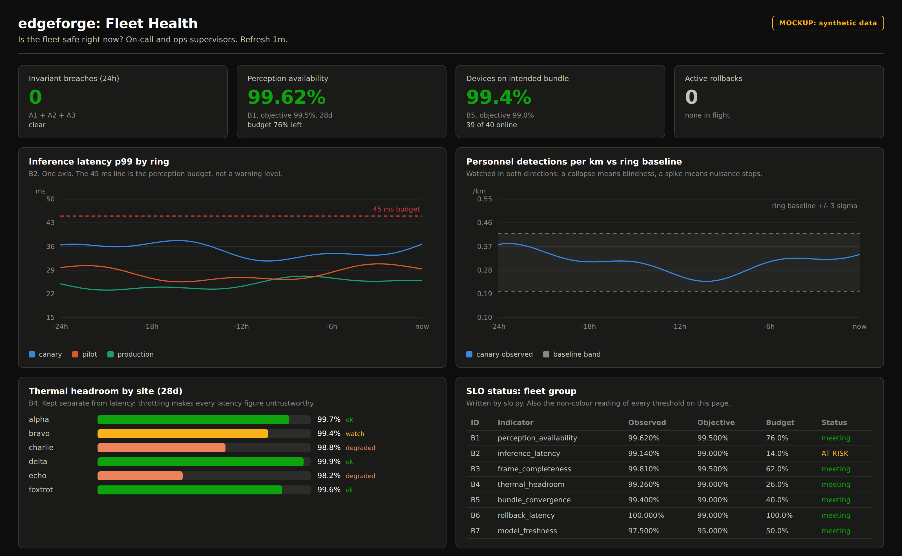
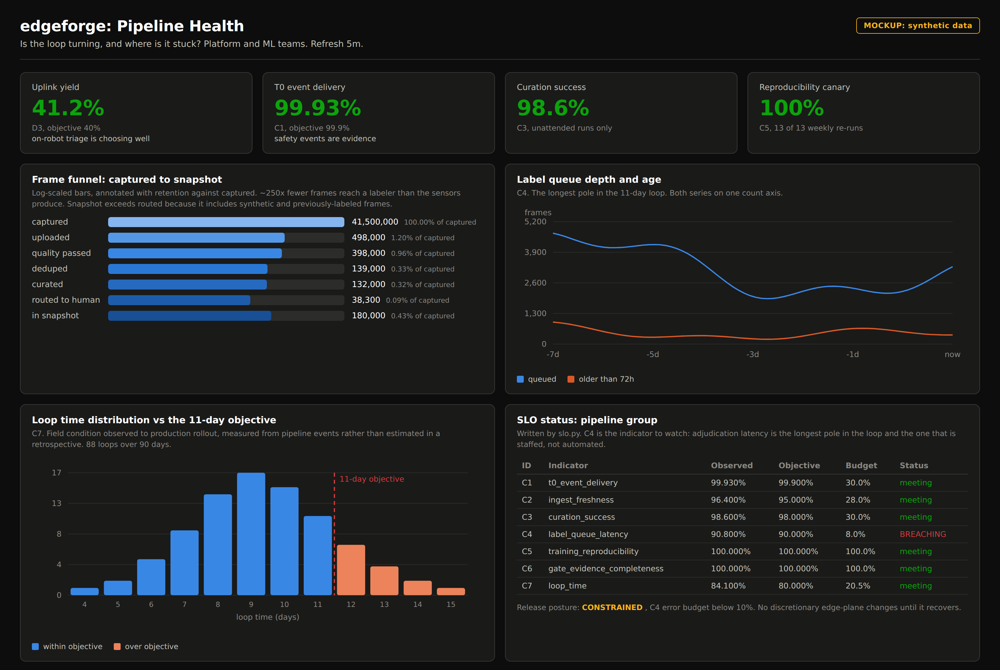
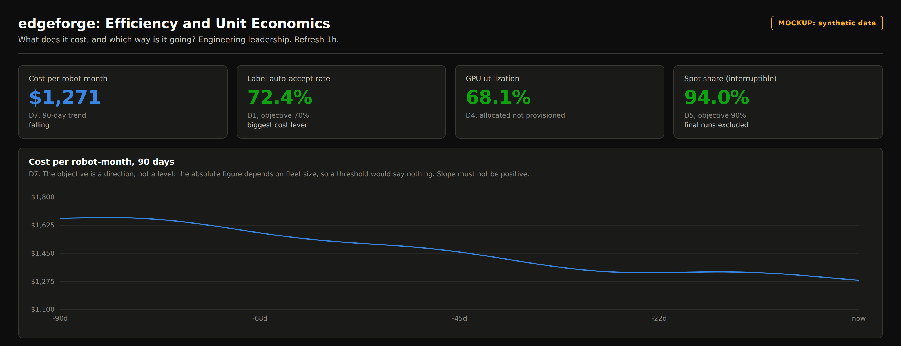

# edgetrainazure: `edgeforge`

**A reference architecture for an end-to-end AI training and deployment platform on
Microsoft Azure, for a fleet of autonomous, edge-inferencing field robots.**

---

## Status: design artifact, not a deployed system

**This is a reference architecture and working design study. It has never been
applied to an Azure subscription, and there is no robot fleet behind it.** Every
number in this repository is a design target or a planning estimate, not a
measurement. Read the table below before reading anything else.

| Maturity | What | Where |
|---|---|---|
| **Implemented and tested** | Decision logic that can be exercised without cloud or hardware: scenario taxonomy, quality gates, dedupe and stratified sampling, snapshot integrity, labeling triage, promotion gates, SLO evaluation and error-budget policy, on-robot frame scoring. **84 unit tests, all passing.** | `src/edgeforge/{taxonomy,curation,labeling,evaluation,fleet}`, `src/edge_modules/curator`, `tests/` |
| **Specified, never executed** | Infrastructure and delivery definitions that are complete and internally consistent, but have never been applied or deployed. `terraform validate` runs in CI; `terraform apply` has never been run. | `infra/`, `pipelines/aml/`, `deploy/`, `observability/dashboards/`, `observability/queries/`, `.github/workflows/` |
| **Interface only** | Real structure and control flow, with device- and storage-facing calls left as explicit `NotImplementedError` hooks. The training loop, ONNX/TensorRT build, and bundle assembly are shaped correctly but not runnable end to end. | `src/edgeforge/{training,optimize,packaging}` |
| **Modeled** | Cost figures, SLO targets, and pipeline ratios. Derived from public Azure list pricing and published results for comparable perception workloads. **Illustrative planning assumptions, not observations.** | `docs/07-cost-model.md`, `observability/slo.yaml` |
| **Not built** | The hardware-in-the-loop rack, an Azure deployment, a robot fleet, a labeling workforce, a safety case. | - |

### What that means for the numbers

Where this document says a rejection rate is 6%, an auto-accept rate is 71%, or
the platform costs $66k/month, those are **assumptions used to size the design
and test whether it hangs together**: the kind of figure you would put in a
planning doc and then go validate. They are stated precisely because a vague
assumption cannot be checked or argued with, not because they have been observed.

Anywhere the design depends on an assumption being roughly right, the assumption
is called out and the consequence of being wrong is stated. See
[`docs/07-cost-model.md`](docs/07-cost-model.md) §7.6 for the ones that matter most.

---

## Executive summary

*For readers who need the shape of this in three minutes. Everything below this
section is the engineering detail.*

### What it is

A closed-loop system that turns what a robot sees in the field into better
software on that robot, continuously, safely, and at falling unit cost. It is
an assembly line for models: instrumented end to end, gated at every stage, with
an undo button.

### The problem it solves

A fleet of autonomous machines works in an environment that is dark, dusty,
GNSS-denied, and shared with people. The machines make decisions from cameras and
LiDAR using AI models. Those models are only as good as the data they learn from,
and the field constantly produces situations no one anticipated.

Three constraints make this hard, and they drive every design decision:

| Constraint | Consequence |
|---|---|
| **The network is the bottleneck, not the computers.** Each robot generates ~180 GB per shift; a site's uplink cannot carry a fraction of it. | The robot must decide *on board* what is worth keeping. |
| **Human labeling is the dominant cost.** Having people annotate what is in each image is ~40× the cost of all the computing combined. | Ask humans about as few images as possible. |
| **The model must fit the machine.** 45 milliseconds, 40 watts, on a robot already running navigation and control. | The model that ships is small, and every optimization is measured on real hardware. |

### How it works, in four steps

1. **The robot triages.** Each machine scores what it sees for novelty and
   uncertainty and keeps only what is genuinely new, roughly a **250× reduction**
   before anything reaches a human. Safety events are always kept.
2. **A large "teacher" model pre-labels.** Humans adjudicate only the images
   where the teacher and the currently-deployed model disagree, modeled at ~18%.
   This is the design's biggest cost lever: on the modeled assumptions it moves
   annotation from ~$200k/month to ~$25k/month.
3. **Training is followed by gating.** A new model must beat the incumbent not
   just on average, but **in every operating condition**, and must record zero
   missed personnel in a 2,000-scenario replay suite. No gate, no release. The
   gates generate safety-case evidence as a by-product.
4. **Release is ringed, and reversible.** Two robots, then one site, then the
   fleet. Live health metrics are watched continuously, and a bad release rolls
   back automatically in minutes, without needing a network connection to the
   robot, because the previous version never leaves the machine.

### What it costs

Modeled at roughly **$66k/month** for a 40-robot fleet, falling to **~$481 per
robot-month at 400 robots** because novelty saturates with fleet size while data
volume does not. The derivation, the sensitivity analysis, and the five
assumptions the answer depends on are in
[`docs/07-cost-model.md`](docs/07-cost-model.md). None of it has been spent.

### How it is measured

The platform reports against **25 indicators** in four groups, 4 safety
invariants plus 21 service-level objectives across fleet reliability, pipeline
health, and efficiency, each with an explicit objective and an error budget.
Three dashboards make this visible without anyone having to ask:

- **Fleet Health**: is the deployed model behaving, right now, per ring and site
- **Pipeline Health**: is the loop turning, and where is it stalled
- **Efficiency**: GPU utilization, spot share, uplink yield, and unit cost, trending

Four indicators are **invariants, not targets**: they have no error budget and a
single breach stops releases fleet-wide. Missed-personnel detection is the first
of them. Full catalogue in [`docs/06-sli-slo-and-telemetry.md`](docs/06-sli-slo-and-telemetry.md).

### The headline design targets

Targets the architecture is built to meet, not results it has produced.

| Measure | Target | Why it matters |
|---|---|---|
| Perception latency, p99 | **≤ 45 ms** under concurrent SoC load | Sets the model size, and therefore everything upstream |
| Sustained power, perception | **≤ 40 W** at 45 C ambient | An Orin that throttles invalidates every latency figure |
| Missed-personnel events | **0, absolute** | No error budget; a single instance blocks release |
| Automatic rollback | **≤ 5 min, no network needed** | Blast radius of a bad release |
| On-robot data reduction | **~85x** before the uplink | The uplink, not the GPU, is the binding constraint |
| Loop time, field condition to full fleet | **≤ 11 days** | Response time to a new hazard |
| Cost per robot-month at 400 robots | **~$481** | Unit economics improve with fleet growth |

---

## 1. Technical specification

### 1.1 Workload envelope

| Property | Value |
|---|---|
| Platform | Class-4 subterranean haulage and inspection robot (`MR-1`) |
| Fleet, design point | 40 robots across 6 sites; architecture sized to 400 |
| Environment | GNSS-denied, 0.1 to 400 lux, airborne particulate to 3.2 g/m3, 45 C ambient |
| Connectivity | None underground; 802.11ax at surface staging, ~50 Mbit/s shared per site |
| Learned components | `hazard-seg`, `drivable-surface`, `personnel-det`, `equipment-anomaly` |

### 1.2 Sensor and data rates, per robot

| Stream | Rate | Per 8 h shift |
|---|---|---|
| 8 cameras (4 stereo pairs), 1920x1200, 20 Hz, 10-bit | 369 Mpx/s, ~460 MB/s uncompressed | ~180 GB after in-line H.265 |
| LiDAR, 32 beam, 10 Hz | ~600k points/s | ~21 GB |
| IMU 200 Hz, wheel odometry, gas and dust | < 1 Mbit/s | ~0.4 GB |
| **Retained after on-robot triage** | | **~2.1 GB** |

The last row is the design's central claim: an 85x reduction decided on the
robot, before the uplink. Fleet-wide that is ~250 GB/day reaching `/raw` instead
of ~7.2 TB/day, against a site link that could carry neither.

### 1.3 Perception latency budget

The 45 ms figure is the perception module, sensor buffer to published obstacle
list. It sits inside the vehicle's ~120 ms sense-to-actuate chain, which the
vehicle team owns.

| Stage | p50 | p99 budget |
|---|---|---|
| Preprocess: letterbox resize, normalize, colour convert | 3 ms | 4 ms |
| TensorRT engine, 4 heads, one backbone pass | 14 ms | 27 ms |
| Postprocess: NMS, safety-envelope geometry, tracking | 4 ms | 6 ms |
| Publish to ROS 2 | 1 ms | 2 ms |
| **Perception module total** | **22 ms** | **39 ms of a 45 ms budget** |

Headroom is deliberate: the engine shares the SoC with SLAM, planning, and
logging, and an Orin throttles as it heats. A model that meets budget cold and
misses it at minute twenty has not met budget.

### 1.4 Model

| | Teacher | Student (ships) |
|---|---|---|
| Backbone width | 96 | 32 |
| Parameters | ~85 M | **~9 M across all four heads** |
| Architecture | Shared depthwise-separable encoder, 4 stages, 2 seg heads + 2 anchor-free det heads |||
| Input | 960x600 letterboxed from 1920x1200 |||
| Precision | BF16 | INT8, with stem, detection heads, and classifiers kept FP16 |
| Runs on | A100, cloud only, never ships | Jetson AGX Orin 64 GB, 40 W sustained |

One backbone pass feeding four heads is a latency decision before it is an
accuracy one: four independent networks do not fit the budget. The multi-head
arrangement also regularizes, since personnel detection and drivable-surface
estimation constrain each other.

### 1.5 Cloud compute topology

`Standard_NC96ads_A100_v4` carries **4x A100 80 GB per node** with NVLink inside
the node, so rank counts are per-GPU and node counts follow from the GPU
footprint, not the other way round.

| Stage | SKU | Nodes x GPU | Total | Notes |
|---|---|---|---|---|
| `pretrain` | NC96ads_A100_v4 | 2 x 4 | 8x A100 | DDP, NCCL; InfiniBand between nodes on ND-series |
| `finetune` | NC96ads_A100_v4 | 2 x 4 | 8x A100 | Determinism on; ~12% throughput cost accepted |
| `distill` | NC96ads_A100_v4 | 1 x 4 | 4x A100 | Single node avoids inter-node gradient traffic entirely |
| `evaluate` | NC24ads_A100_v4 | 1 x 1 | 1x A100 | Distinct identity: the only one with golden-set access |
| sweeps | NC96ads_A100_v4, low-priority | <= 2 x 4 | <= 8x A100 | Preempted trials are cheap; final runs are never spot |
| simulation | NV36ads_A10_v5, spot | <= 20 x 1 | <= 20x A10 | Headless Isaac Sim, fully interruption tolerant |
| edge build | Jetson AGX Orin 64 GB | 4 modules | HIL rack | Arc-enabled, self-hosted runners; the only place engines are built |

### 1.6 Storage and telemetry footprint at 40 robots

| Zone | Volume | Tiering |
|---|---|---|
| `/raw` | ~1.2 PB steady state | Hot 30-90 d, Cool, Archive; immutable, 7-year retention |
| `/clean` | ~40 TB | Deleted at 90 d; a pure function of `/raw` plus pinned code |
| `/curated` + `/labeled` | ~55 TB | Never deleted; contains human labeling effort |
| `/snapshot` | ~35 TB | Frozen deep clones, content-addressed by Merkle root |
| Telemetry | ~120 GB/day | Log Analytics, commitment tier, 180 d interactive |

---

## 2. The loop

`edgeforge` is a **data flywheel**, not a linear pipeline. Robots produce the data
that trains the models that go back onto the robots that produce better data.

```
                       ┌──────────────────────────────────────────────┐
                       │                                              │
                       ▼                                              │
   ┌───────────┐   ┌────────┐   ┌──────────┐   ┌───────────┐   ┌──────────────┐
   │  INGEST   │──▶│ CURATE │──▶│  LABEL   │──▶│   TRAIN   │──▶│   EVALUATE   │
   │ IoT Hub / │   │ Databr │   │ AML Data │   │ AML GPU   │   │ golden set + │
   │ ADLS/Box  │   │ + Delta│   │ Labeling │   │ + MLflow  │   │ closed-loop  │
   └───────────┘   └────────┘   └──────────┘   └───────────┘   └──────┬───────┘
        ▲                                                             │ gate
        │                                                             ▼
   ┌────┴──────┐   ┌────────────┐   ┌─────────────┐   ┌──────────────────────┐
   │ ACTIVE    │◀──│  FLEET     │◀──│  ROLLOUT    │◀──│  OPTIMIZE + PACKAGE  │
   │ LEARNING  │   │ TELEMETRY  │   │ canary→prod │   │ ONNX→TensorRT INT8   │
   │ uploads   │   │ + drift    │   │ IoT Edge    │   │ signed OCI bundle    │
   └───────────┘   └────────────┘   └─────────────┘   └──────────────────────┘
```

The reference workload is a **Class-4 subterranean haulage & inspection robot**
(`MR-1`) operating in an underground hard-rock mine. The platform is
domain-agnostic; the same pipeline runs unchanged for any complex robot whose
perception stack must be trained centrally and executed at the edge.

Nine stages, each independently runnable, each gated:

| # | Stage | Primary Azure service | Entry point |
|---|-------|----------------------|-------------|
| 1 | Ingest | IoT Hub, ADLS Gen2, Data Box | `src/edge_modules/curator/` |
| 2 | Curate | Databricks (Delta), AML data jobs | `src/edgeforge/curation/` |
| 3 | Label | AML Data Labeling + teacher auto-label | `src/edgeforge/labeling/` |
| 4 | Synthesize | Isaac Sim on Azure Batch GPU | `sim/` |
| 5 | Train | AML command/sweep jobs, MLflow | `src/edgeforge/training/` |
| 6 | Evaluate | AML jobs + closed-loop sim replay | `src/edgeforge/evaluation/` |
| 7 | Optimize | ONNX Runtime, TensorRT INT8 on HIL rack | `src/edgeforge/optimize/` |
| 8 | Package | ACR arm64 multi-arch, Notation signing | `src/edgeforge/packaging/` |
| 9 | Roll out | IoT Edge layered deployments, rings | `deploy/rollout/` |

Observability spans all nine: [`observability/`](observability) holds the SLO
definitions, the KQL behind every dashboard panel, and the dashboards themselves.

---

## 3. Why each choice

**Ingest is store-and-forward, not streaming.** A robot underground has no link.
The `curator` edge module writes MCAP shards to a local ring buffer and only
uploads when it surfaces onto site Wi-Fi. High-value shards are uploaded first,
ordered by a priority score computed *on the robot*. Bulk history moves by Azure
Data Box when a site accumulates faster than its uplink drains.

**Curation is a gate, not a transform.** The design assumes the large majority of
raw field frames are near-duplicates of frames already in the dataset. Blur/exposure/dust rejection,
perceptual-hash plus embedding dedupe, and stratified sampling against the
scenario taxonomy all run before anything reaches a labeler.

**Labeling is teacher-student, human-verified.** A large open-vocabulary detector
pre-labels every frame. Humans only adjudicate where teacher confidence is low or
teacher and production model disagree. The single biggest cost lever in the system.

**Training is curriculum, not one-shot.** Pre-train on synthetic (domain
randomized), fine-tune on real, then distill the large model into the edge-sized
student. The teacher never ships; only the student does.

**Evaluation is closed-loop, not just mAP.** A model that improves mAP but
degrades time-to-brake is a regression. Gates in
`src/edgeforge/evaluation/gates.py` are hard: no gate, no promotion.

**Optimization is measured on real silicon.** INT8 quantization error, latency,
and sustained power are measured on a hardware-in-the-loop rack of the exact
target module, never estimated from cloud GPU numbers.

**Rollout is ringed with automatic rollback.** Canary (2 robots) → pilot (1 site)
→ production, each gated on live fleet health with a twin-driven rollback that
does not require a new deployment or a network round-trip to the robot.

---

## 4. Dashboards

Three boards, each answering exactly one question. Provisioned as code from
[`observability/dashboards/`](observability/dashboards) with `editable=false`, so
they are changed in git rather than in the UI. The KQL behind every panel is in
[`observability/queries/`](observability/queries), one file per indicator.

**The screenshots below are mockups rendered from the panel definitions, with
synthetic data.** No fleet has reported into these.

### Fleet Health

Is the fleet safe right now? Invariant breaches, latency against the 45 ms
budget per ring, personnel-detection rate against a 3-sigma ring baseline, and
thermal headroom per site.



Two details that matter more than they look:

- **Series are colored by ring, not by rank.** Filtering out `pilot` must not
  repaint `canary`. Color follows the entity.
- **Personnel rate is watched in both directions.** A collapse means the model
  has gone blind; a spike means nuisance stops, and operators learn to override a
  model that cries wolf. Both are rollback conditions.

### Pipeline Health

Is the loop turning, and where is it stuck? The funnel is the panel that answers
that at a glance, which is where the ingest-backlog playbook starts.



The board is deliberately rendered in a **breaching** state. `C4`
(label-queue latency) is below its error budget, so `release_posture()` returns
`CONSTRAINED` and discretionary edge-plane changes stop until it recovers. A
dashboard that only ever shows green does not demonstrate that the mechanism
works.

### Efficiency and Unit Economics



Cost panels are indexed to a common base rather than plotted against a second
axis. A dual-axis chart comparing dollars to percentages is the fastest way to
make a cost trend say whatever the reader already believed, and CI rejects any
panel that declares one.

---

## 5. Repository layout

```
docs/                    Architecture, security, SLI/SLO, cost, runbook
docs/images/             Dashboard mockups rendered from the panel definitions
infra/                   Terraform for the whole Azure footprint
observability/           SLO definitions, KQL queries, Grafana dashboards
pipelines/aml/           Azure ML pipeline + component definitions (YAML v2)
src/edgeforge/           Cloud-side Python: curation, labeling, training, eval, optimize, fleet
src/edge_modules/        On-robot IoT Edge modules: perception, curator
deploy/iot-edge/         Base + layered deployment manifests
deploy/rollout/          Ring definitions and the rollout/rollback driver
sim/                     Synthetic data generation scenarios and domain randomization
.github/workflows/       CI, training, promotion, edge release, fleet rollout
```

Read the docs in order:

1. [`docs/01-architecture.md`](docs/01-architecture.md): the whole system, one page
2. [`docs/02-data-plane.md`](docs/02-data-plane.md): ingest, lake zones, curation
3. [`docs/03-training-plane.md`](docs/03-training-plane.md): labeling, sim, training, eval
4. [`docs/04-edge-plane.md`](docs/04-edge-plane.md): optimize, package, deploy, feedback
5. [`docs/05-security-and-governance.md`](docs/05-security-and-governance.md)
6. [`docs/06-sli-slo-and-telemetry.md`](docs/06-sli-slo-and-telemetry.md): SLIs, SLOs, error budgets, dashboards
7. [`docs/07-cost-model.md`](docs/07-cost-model.md)
8. [`docs/08-runbook.md`](docs/08-runbook.md)

---

## 6. Quickstart

```bash
# 0. Prereqs: az CLI, terraform >= 1.6, python >= 3.11, ml extension
az login && az account set -s "$AZ_SUBSCRIPTION_ID"
az extension add -n ml

# 1. Stand up the footprint (~25 min; GPU quota must exist in the region)
cd infra
cp terraform.tfvars.example terraform.tfvars   # edit: prefix, region, cidrs
terraform init && terraform apply

# 2. Register environments, components, dashboards, and SLO rules
make register-aml
make register-observability

# 3. Curate a raw drop into a versioned dataset
make curate RAW_URI="azureml://datastores/raw/paths/site-alpha/2026-08-01/"

# 4. Train + evaluate (submits an AML pipeline job, streams to MLflow)
make train MODEL=hazard-seg DATASET=mr1-hazard:12

# 5. Optimize, package, and sign an edge bundle for a promoted model
make edge-bundle MODEL=hazard-seg VERSION=41 TARGET=orin-agx-64

# 6. Roll to the canary ring
make rollout BUNDLE=hazard-seg:41 RING=canary

# 7. Check current standing against the objectives
make slo-report
```

Every `make` target is a thin wrapper over an `az ml` / `az iot` call,
see the [`Makefile`](Makefile). Nothing is hidden behind bespoke tooling.
